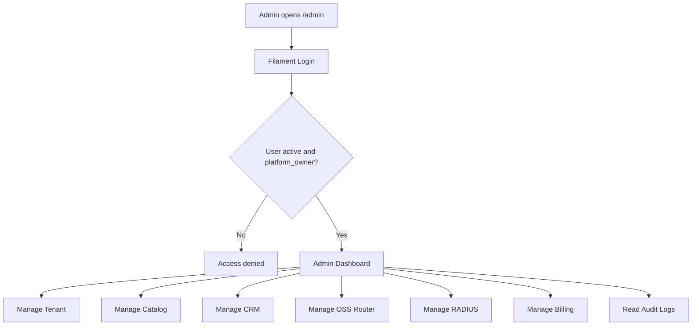
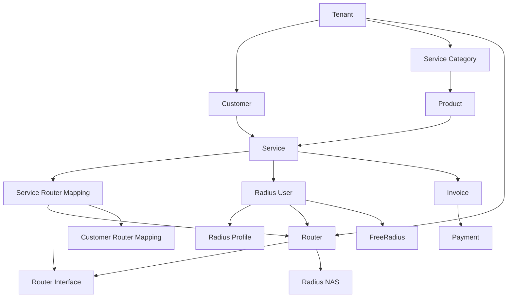
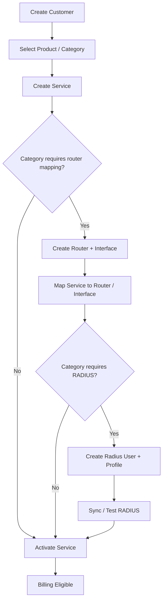
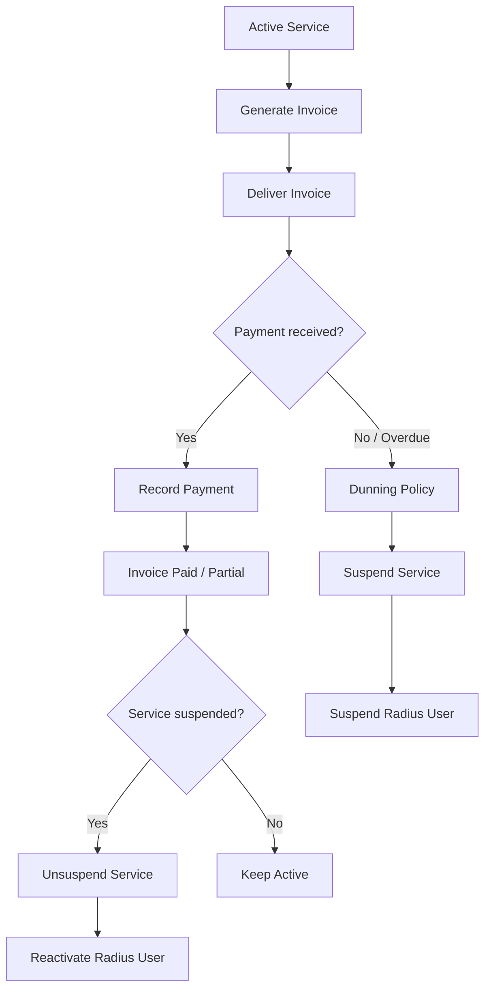
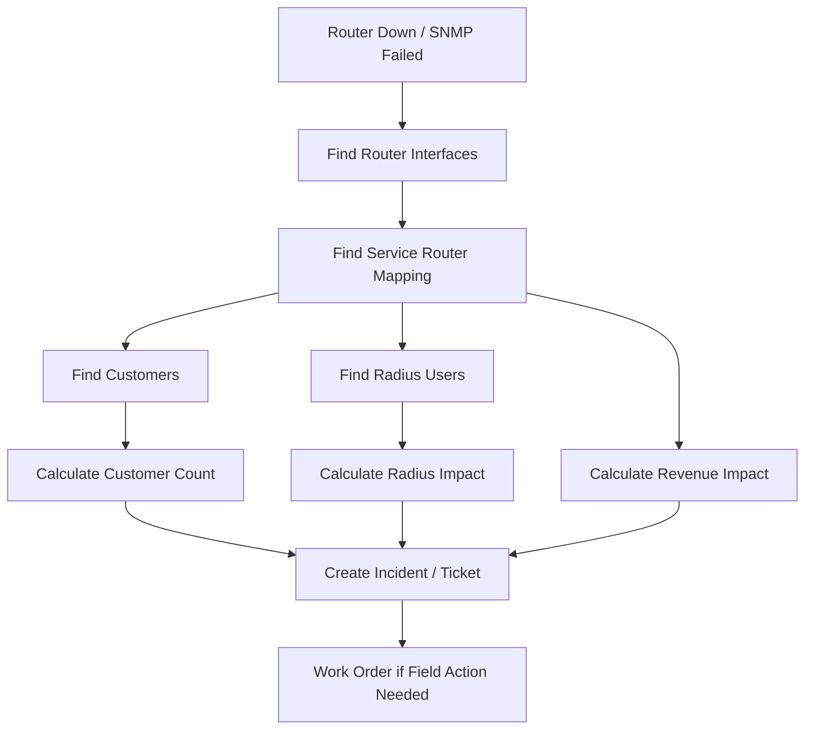
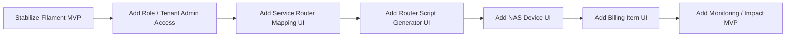

# NEXBIL Current Implementation Flowchart

Status: after Laravel API MVP + Filament Admin Panel
Source: PRD v3.4 Router-Centric, pre-coding blueprint, and implemented MVP.

## Current System Access Flow

## Router-Centric OSS/BSS Flow

## Service Activation Flow

## Billing, Suspend, Unsuspend Flow

## Router Down Impact Flow

## Next Build Priority

## Immediate Manual Test Checklist

- Login to `/admin`.
- Open `Tenants`, verify `NEX Demo ISP`.
- Open `Routers`, edit seed router and set role `PPPoE Router`.
- Open `Radius Servers`, verify FreeRadius host.
- Open `Customers`, create one test customer.
- Open `Services`, create one service for that customer.
- Use API for service-router mapping until the Filament mapping resource is added.
- Create Radius User.
- Create Invoice and Payment.
- Check `Audit Logs`.
